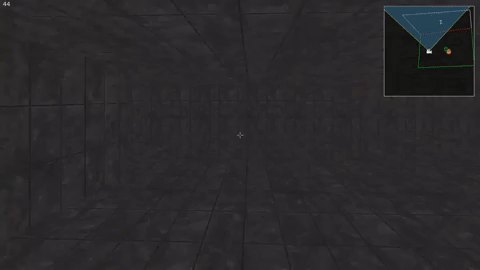
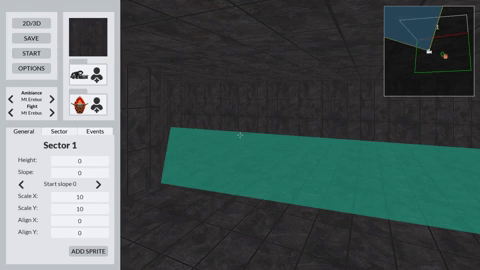

42 projet Doom-Nukem

This project had for objective to create a game based on Doom and Duke-nukem (two games from the 90s).
But we had to do it following some conditions: the project had to be in C (and only in this language), we were not allowed to use the graphics card, there has to be an editor in wich you had to be able to create anything you wanted.

gameplay:

https://www.youtube.com/watch?v=qHFw4_NmulA&t=33s

editor:

https://www.youtube.com/watch?v=AtxenRiuVxg&feature=youtu.be

